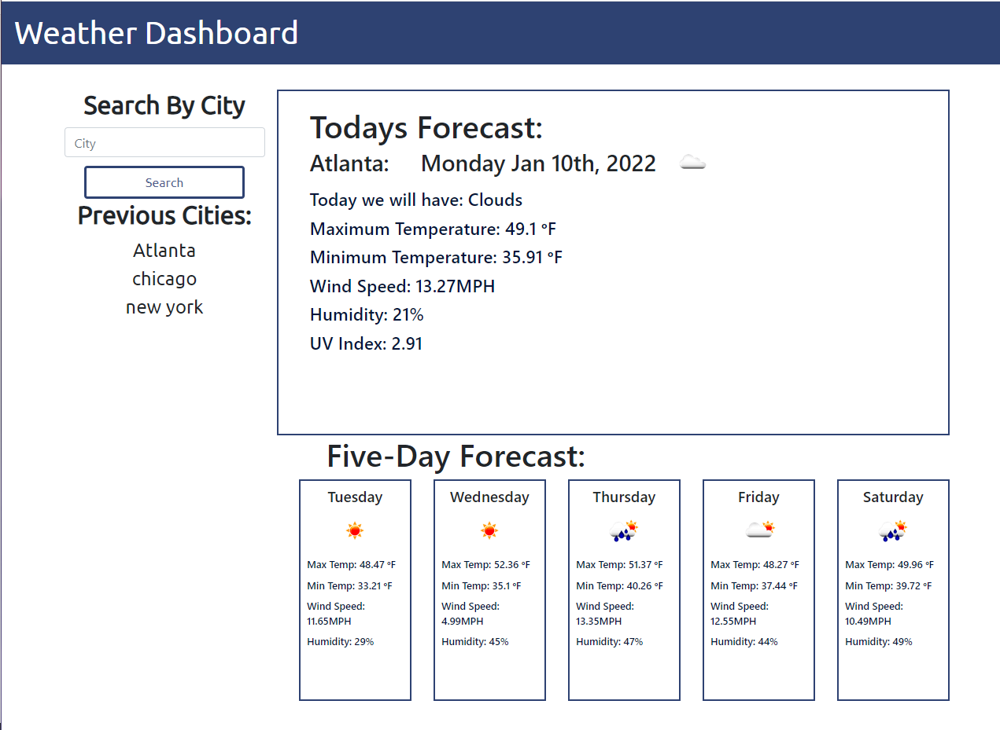

# Weather Dashboard

Single page dashboard where you can search by city to display the upcoming weather.

## Host Location:

https://mattplawrence.github.io/Weather-Dashboard/

## Purpose:

The purpose of this project was to create an quick and simple website to see current and upcoming weather in a city of interest.

## Problem:

The problem is to find a way to use the third party API's to retrieve location and weather data for the requested city.

### The problems encountered include:

- The API that returns weather take coordinates as input, not cities. I had to find an additional API to search by city.
- Link the data from the two API calls to work with each other.
- Separate and return the desirable data from the JSON returned by the APIs.
- Use bootstrap grid system for the layout of the website.
- Use JQuery to append the DOM to display the weather in the correct areas.
- Find the date using moment, and display in the correct way.
- Store search information in local storage, and recall to display.

## What I learned:

I learned in more detail how to use third party APIs to return information. I now have a more in-depth understanding of how to extract the usable data from the large mass of data that an API returns. I learned how to use loops to append multiple parts of the DOM using less code.

## Preview:

The website landing page as written in this repository should look like the following image:

